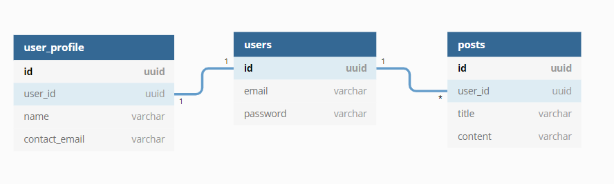

## Description

This project demonstrates how to query for a nested relation through typeorm.

Use this [Insomnia workspace](./other/insomnia.json) to make REST requests.

<p align="center"></p>

Objective: retrieve both user and user_profile information when retrieving the list of posts.

### Base models

```js
@Entity('posts')
class Post {
  @PrimaryGeneratedColumn('uuid')
  id: string;

  @Column()
  user_id: string;

  @ManyToOne(() => User, (user) => user.posts)
  @JoinColumn({ name: 'user_id' })
  user: User;

  @Column()
  title: string;

  @Column()
  content: string;
}
```

```js
@Entity('users')
class User {
  @PrimaryGeneratedColumn('uuid')
  id: string;

  @Column()
  email: string;

  @Column()
  @Exclude()
  password: string;

  @OneToOne(() => UserProfile, (user_profile) => user_profile.user)
  user_profile: UserProfile;

  @OneToMany(() => Post, (post) => post.user)
  posts: Post[];
}
```

```js
@Entity('user_profiles')
class UserProfile {
  @PrimaryGeneratedColumn('uuid')
  id: string;

  @Column()
  user_id: string;

  @OneToOne(() => User, (user) => user.user_profile)
  @JoinColumn({ name: 'user_id' })
  user: User;

  @Column()
  name: string;

  @Column()
  contact_email: string;
}
```

Note: when running the code, it's necessary to have a database like postgres or mysql running and fill ormconfig.json with the respective settings.

## Comparison

The response we get in all queries (but the last one, which uses select to remove some fields) is:

```json
[
  {
    "id": "3eba562f-e51c-47bd-83fc-53384fa4ff69",
    "user_id": "a40a7cc7-3328-44cd-b7cd-e6cc41f6ff07",
    "title": "Title 1",
    "content": "Content 1",
    "user": {
      "id": "a40a7cc7-3328-44cd-b7cd-e6cc41f6ff07",
      "email": "user@domain.com",
      "password": "123456",
      "user_profile": {
        "id": "f9a1d91d-86f9-489a-b132-ec00e33c7257",
        "user_id": "a40a7cc7-3328-44cd-b7cd-e6cc41f6ff07",
        "name": "User",
        "contact_email": "user@domain.com"
      }
    }
  }
]
```

Note: we can hide the password by applying `classToClass` to the posts array in `PostsController.ts`.
I forgot to apply it. For reference, check its application on `UsersController.ts`.

The different methods are presented in different branches.
Click the titles of each section to jump to the related commit.

### [Eager Loading](https://github.com/jobsonita/test-typeorm-relation-nested/compare/solution1)

```js
/* Post.ts */
  @ManyToOne(() => User, (user) => user.posts, { eager: true })
  @JoinColumn({ name: 'user_id' })
  user: User;

/* User.ts */
  @OneToOne(() => UserProfile, (user_profile) => user_profile.user, {
    eager: true,
  })
  user_profile: UserProfile;

/* PostsRepository.ts */
  async findAll(): Promise<Post[]> {
    return this.ormRepository.find();
  }
```

```sql
SELECT "Post"."id" AS "Post_id", "Post"."user_id" AS "Post_user_id", "Post"."title" AS "Post_title", "Post"."content" AS "Post_content", "Post_user"."id" AS "Post_user_id", "Post_user"."email" AS "Post_user_email", "Post_user"."password" AS "Post_user_password", "Post_user_user_profile"."id" AS "Post_user_user_profile_id", "Post_user_user_profile"."user_id" AS "Post_user_user_profile_user_id", "Post_user_user_profile"."name" AS "Post_user_user_profile_name", "Post_user_user_profile"."contact_email" AS "Post_user_user_profile_contact_email" FROM "posts" "Post" LEFT JOIN "users" "Post_user" ON "Post_user"."id"="Post"."user_id"  LEFT JOIN "user_profiles" "Post_user_user_profile" ON "Post_user_user_profile"."user_id"="Post_user"."id"
```

Pros:
- simple

Cons:
- inefficient (queries for posts always bring users and their profiles)
- only allow one way (post -> user -> user_profile), cannot have on both ways ([typeorm restriction](https://github.com/typeorm/typeorm/blob/master/docs/eager-and-lazy-relations.md#eager-relations))
- loads all fields (selects everything)

### [Find with `relations` array](https://github.com/jobsonita/test-typeorm-relation-nested/compare/solution2)

```js
/* PostsRepository.ts */
  async findAll(): Promise<Post[]> {
    return this.ormRepository.find({
      relations: ['user', 'user.user_profile'],
    });
  }
```

```sql
SELECT "Post"."id" AS "Post_id", "Post"."user_id" AS "Post_user_id", "Post"."title" AS "Post_title", "Post"."content" AS "Post_content", "Post__user"."id" AS "Post__user_id", "Post__user"."email" AS "Post__user_email", "Post__user"."password" AS "Post__user_password", "Post__user__user_profile"."id" AS "Post__user__user_profile_id", "Post__user__user_profile"."user_id" AS "Post__user__user_profile_user_id", "Post__user__user_profile"."name" AS "Post__user__user_profile_name", "Post__user__user_profile"."contact_email" AS "Post__user__user_profile_contact_email" FROM "posts" "Post" LEFT JOIN "users" "Post__user" ON "Post__user"."id"="Post"."user_id"  LEFT JOIN "user_profiles" "Post__user__user_profile" ON "Post__user__user_profile"."user_id"="Post__user"."id"
```

Pros:
- simple
- applies only to that specific query
- able to select specific fields
- able to apply other query constraints

Cons:
- need to know the nested fields
- applies to a single query, must repeat whenever the same format is needed

### QueryBuilder

#### [Plain](https://github.com/jobsonita/test-typeorm-relation-nested/commit/b7f6c31d38ef1ce7217f30cf7111904780d87d5b)

```js
/* PostsRepository.ts */
  async findAll(): Promise<Post[]> {
    return this.ormRepository
      .createQueryBuilder()
      .leftJoinAndSelect('Post.user', 'Post__user')
      .leftJoinAndSelect('Post__user.user_profile', 'Post__user__user_profile')
      .getMany();
  }
```

```sql
SELECT "Post"."id" AS "Post_id", "Post"."user_id" AS "Post_user_id", "Post"."title" AS "Post_title", "Post"."content" AS "Post_content", "Post__user"."id" AS "Post__user_id", "Post__user"."email" AS "Post__user_email", "Post__user"."password" AS "Post__user_password", "Post__user__user_profile"."id" AS "Post__user__user_profile_id", "Post__user__user_profile"."user_id" AS "Post__user__user_profile_user_id", "Post__user__user_profile"."name" AS "Post__user__user_profile_name", "Post__user__user_profile"."contact_email" AS "Post__user__user_profile_contact_email" FROM "posts" "Post" LEFT JOIN "users" "Post__user" ON "Post__user"."id"="Post"."user_id"  LEFT JOIN "user_profiles" "Post__user__user_profile" ON "Post__user__user_profile"."user_id"="Post__user"."id"
```

Pros:
- highly optimizable (can select specific fields)
- can use aliases (rename fields)

Cons:
- complex
- bad readability
- need to know the nested relations

#### [With aliases (better readability)](https://github.com/jobsonita/test-typeorm-relation-nested/commit/bc47d7478306cbe91dccad5aadaf19ce774f38ea)

```js
/* PostsRepository.ts */
  async findAll(): Promise<Post[]> {
    return this.ormRepository
      .createQueryBuilder('p')
      .leftJoinAndSelect('p.user', 'u')
      .leftJoinAndSelect('u.user_profile', 'up')
      .getMany();
  }
```

```sql
SELECT "p"."id" AS "p_id", "p"."user_id" AS "p_user_id", "p"."title" AS "p_title", "p"."content" AS "p_content", "u"."id" AS "u_id", "u"."email" AS "u_email", "u"."password" AS "u_password", "up"."id" AS "up_id", "up"."user_id" AS "up_user_id", "up"."name" AS "up_name", "up"."contact_email" AS "up_contact_email" FROM "posts" "p" LEFT JOIN "users" "u" ON "u"."id"="p"."user_id"  LEFT JOIN "user_profiles" "up" ON "up"."user_id"="u"."id"
```

#### [With select](https://github.com/jobsonita/test-typeorm-relation-nested/commit/4ec3af35e3f69a7569d51b6a1e92e5b1775a518e)

```js
/* PostsRepository.ts */
  async findAll(): Promise<Post[]> {
    return this.ormRepository
      .createQueryBuilder('p')
      .leftJoinAndSelect('p.user', 'u')
      .leftJoinAndSelect('u.user_profile', 'up')
      .select(['p.id', 'p.title', 'p.content'])
      .addSelect(['u.id', 'u.email'])
      .addSelect(['up.id', 'up.name', 'up.contact_email'])
      .getMany();
  }
```

```sql
SELECT "p"."id" AS "p_id", "p"."title" AS "p_title", "p"."content" AS "p_content", "u"."id" AS "u_id", "u"."email" AS "u_email", "up"."id" AS "up_id", "up"."name" AS "up_name", "up"."contact_email" AS "up_contact_email" FROM "posts" "p" LEFT JOIN "users" "u" ON "u"."id"="p"."user_id"  LEFT JOIN "user_profiles" "up" ON "up"."user_id"="u"."id"
```

```json
[
  {
    "id": "3eba562f-e51c-47bd-83fc-53384fa4ff69",
    "title": "Title 1",
    "content": "Content 1",
    "user": {
      "id": "a40a7cc7-3328-44cd-b7cd-e6cc41f6ff07",
      "email": "user@domain.com",
      "user_profile": {
        "id": "f9a1d91d-86f9-489a-b132-ec00e33c7257",
        "name": "User",
        "contact_email": "user@domain.com"
      }
    }
  }
]
```
